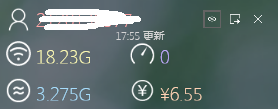

# NKUWLAN-Desktop

南开网关登录客户端桌面版 NKU_WALN Client for Windows Desktop

[下载最新发布版本](https://github.com/NKMSC/NKUWLAN-Desktop/releases)

### 特性(features)

* [x] 网关登录 【done】 
* [x] 网关注销 【done】
* [x] 流量查询 【done】
* [x] 保存账号 【done】
* [x] 自动登录 【done】
* [x] 托盘程序 【done】
* [x] 开机启动 【done】
* [x] 自动刷新 【done】
* [x] 流量监控 【done】
* [x] 界面美化 【done】
* [x] 靠边隐藏 【done】
* [x] 内网地址 【done】
* [ ] 注销确认 【todo】
* [ ] 配置设置
* [ ] 说明窗口 
* [ ] 流量管理 
* [ ] 关机注销
* [ ] 后台服务
* [ ] 账户管理

### 截图 

* 登录 
* 信息 
* 自动登录托盘显示 

### 引用

* [其他版本](http://nkuwlan.newfuture.cc)
* 根据[NKUWLAN](https://github.com/NewFuture/NKUWLAN)网关接口修改而成
* 登录界面修改自[QQIdea](https://github.com/JsonRuby/QQIdea)
* LOGO修改自网络南开表情包


### 目录结构

```
__
│
│  GatewayClient-Desktop.sln [VS 2015解决方案]
│  LICENSE
│  README.md
│
└─GatewayClient-Desktop
    │
	│  App.xaml.cs  [APP 入口]
	│  AutoStart.cs  [开机启动]
    │  Config.cs     [配置读写]
    │  Gateway.cs    [网关接口]
    │  InfoWindow.xaml     [信息界面]
    │  InfoWindow.xaml.cs  [界面响应]
	│  LoginWindow.xaml     [登录界面]
    │  LoginWindow.xaml.cs  [界面响应]
    │  TrayNotify.cs	[托盘通知]
	└─images 图片资源

```

### 作者&贡献者

@[NewFuture](https://github.com/NewFuture)  
@[MYoung](https://github.com/0237) 

### 协议和授权
Apache2 License 开源协议
